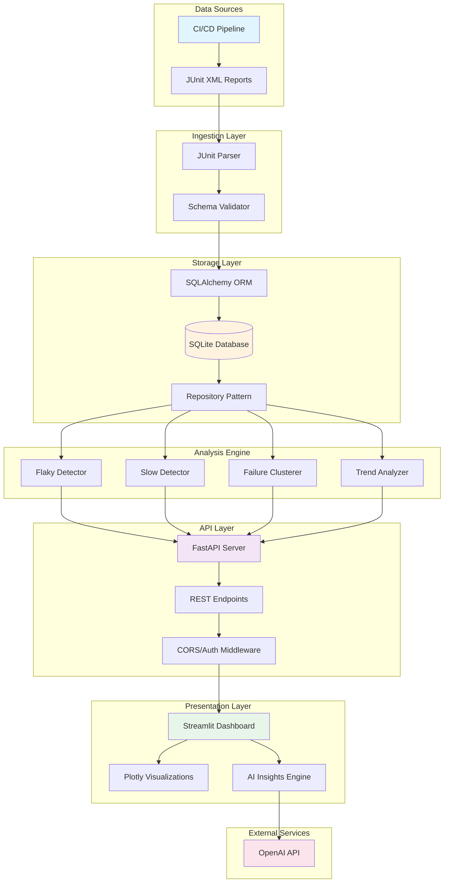
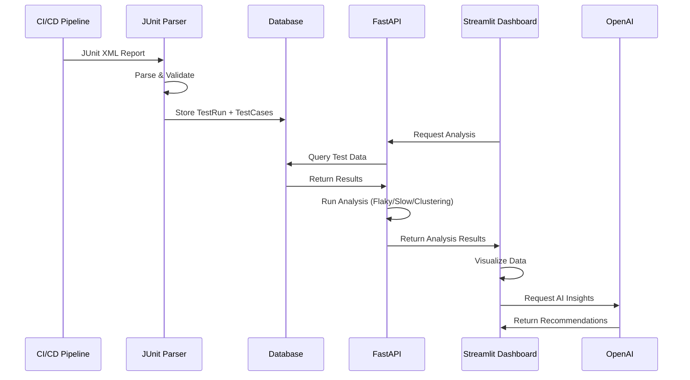

# Test Report Analyzer

> **An enterprise-grade platform engineering solution for automated test analysis, reporting, and quality intelligence**

[](https://www.python.org/downloads/)
[](https://fastapi.tiangolo.com)
[](https://streamlit.io)

---

## Table of Contents

- [Overview](#-overview)
- [Key Features](#-key-features)
- [Architecture](#-architecture)
- [Technology Stack](#-technology-stack)
- [Quick Start](#-quick-start)
- [Usage Guide](#-usage-guide)
- [API Documentation](#-api-documentation)
- [Dashboard Features](#-dashboard-features)
- [Data Flow](#-data-flow)
- [Advanced Usage](#-advanced-usage)
- [Development](#-development)
- [CI/CD Integration](#-cicd-integration)
- [Troubleshooting](#-troubleshooting)
- [Contributing](#-contributing)

---

## Overview

Test Report Analyzer is a comprehensive platform engineering solution designed to transform raw test execution data into actionable quality intelligence. Built for QA engineers, SDETs, and development teams, it provides automated analysis of test results, identifies patterns in failures, detects performance regressions, and surfaces quality trends over time.

### Problem Statement

Modern software teams face several challenges with test reporting:
- **Manual Analysis**: Engineers spend hours analyzing test failures manually
- **Hidden Patterns**: Flaky tests and intermittent failures go undetected
- **Performance Degradation**: Slow test execution creeps in unnoticed
- **Lack of Visibility**: Quality trends are difficult to track across sprints
- **Scattered Data**: Test results live in multiple systems without centralization

### Solution

This platform provides:
1. **Automated Ingestion**: Parse JUnit XML reports from any CI/CD pipeline
2. **Intelligent Analysis**: ML-powered detection of flaky tests, slow tests, and failure patterns
3. **Centralized Storage**: Unified database for historical test data and trends
4. **REST API**: Programmatic access for integration with existing tools
5. **Interactive Dashboard**: Real-time visualization of quality metrics and insights
6. **AI-Powered Recommendations**: GPT-based analysis for root cause identification

---

## Key Features

### Intelligent Test Analysis

- **Flaky Test Detection**
  - Analyzes test execution history to identify inconsistent tests
  - Calculates flakiness score based on pass/fail patterns
  - Provides severity classification (Critical, High, Medium, Low)
  - Tracks pass rate, failure occurrences, and temporal patterns

- **Slow Test Identification**
  - Establishes performance baselines using p95 latency
  - Detects duration regressions and performance degradation
  - Categorizes tests by speed (Critical, Slow, Medium, Fast)
  - Calculates ROI for optimization efforts

- **Failure Clustering**
  - Groups similar failures using error message similarity analysis
  - Identifies common root causes across test failures
  - Detects temporal failure patterns and anomalies
  - Provides actionable remediation suggestions

### Quality Metrics & Trends

- **Health Score Calculation**
  - Composite metric based on pass rate, flakiness, and execution time
  - Color-coded visualization (Excellent, Good, Fair, Poor, Critical)
  - Historical trending with configurable lookback periods
  - Module-level and suite-level breakdowns

- **Daily & Weekly Trends**
  - Pass/fail rate trends over time
  - Test count growth tracking
  - Duration trend analysis
  - Anomaly detection with statistical thresholds

### Interactive Dashboard

- **Overview Page**: Real-time health score, latest run statistics, failure trends
- **Flaky Tests Page**: Detailed flakiness analysis with execution history
- **Slow Tests Page**: Performance analysis with optimization calculator
- **Failure Analysis Page**: Clustered failures with root cause suggestions
- **AI Insights Page**: GPT-powered comprehensive analysis and recommendations

### REST API

- 30+ endpoints for programmatic access
- OpenAPI/Swagger documentation
- CORS-enabled for web integration
- JWT-ready authentication hooks
- Batch ingestion support

### AI Integration

- OpenAI GPT-4 integration for intelligent analysis
- Multiple analysis modes (comprehensive, flaky-focused, performance, failure-specific)
- Prompt transparency for AI explainability
- Export capability for analysis results

---

## Architecture

### High-Level System Design



### Component Architecture

| Layer | Components | Purpose |
|-------|------------|----------|
| **Ingestion** | JUnit Parser, Schema Validator | Parse and validate test reports |
| **Storage** | SQLite/PostgreSQL, SQLAlchemy ORM, Repository Pattern | Persistent data storage and access |
| **Analysis** | Flaky Detector, Slow Detector, Failure Clusterer, Trend Analyzer | Intelligent test analysis algorithms |
| **API** | FastAPI, REST Endpoints, Middleware | HTTP API for programmatic access |
| **Presentation** | Streamlit Dashboard, Plotly Charts, AI Engine | Interactive visualization and insights |
| **External** | OpenAI API | AI-powered analysis and recommendations |

---

## Technology Stack

### Core Framework
- **Python 3.11+**: Modern Python with type hints
- **FastAPI 0.109.0**: High-performance async REST API
- **Streamlit 1.31.0**: Interactive dashboard framework
- **SQLAlchemy 2.0**: Modern ORM with async support

### Data & Analysis
- **Pandas 2.1.4**: Data manipulation and analysis
- **NumPy 1.26.3**: Numerical computations
- **Plotly 5.18.0**: Interactive visualizations
- **scikit-learn**: Clustering and similarity analysis

### Testing & Quality
- **Pytest 7.4.4**: Testing framework
- **Black**: Code formatting
- **Ruff**: Fast Python linter
- **MyPy**: Static type checking

### Infrastructure
- **Docker & Docker Compose**: Containerization
- **Uvicorn**: ASGI server
- **SQLite/PostgreSQL**: Database options

---

## Quick Start

### 1. Setup Environment

```bash
# Create virtual environment
python3 -m venv venv
source venv/bin/activate  # On Windows: venv\Scripts\activate

# Install dependencies
pip install -r requirements.txt

# Copy environment template
cp .env.example .env
```

### 2. Initialize Database

```bash
# Initialize the database (creates SQLite DB with schema)
python storage/database.py
```

Expected output:
```
Database initialized at: sqlite:///data/test_reports.db
```

### 3. Ingest Sample Test Report

```bash
# Ingest the sample test report
python ingest_report.py tests/fixtures/sample_report.xml \
    --project my-app \
    --branch main \
    --commit abc123
```

Expected output:
```
============================================================
Ingesting Test Report: tests/fixtures/sample_report.xml
============================================================

Step 1: Parsing JUnit XML...
✓ Successfully parsed 15 test cases

Test Run Summary:
  Project: my-app
  Branch: main
  Commit: abc123
  Timestamp: 2026-03-09 10:30:00
  Total Tests: 15
  Passed: 11 (73.3%)
  Failed: 3
  Skipped: 1
  Duration: 12.46s
  Status: failure

Step 2: Storing in database...
✓ Successfully stored test run (ID: 1)
  - Test run record created
  - 15 test case records created

Step 3: Analysis...

⚠ Failed Tests (3):
  - tests.services.test_payment::test_payment_gateway_timeout
    Type: TimeoutError
    Error: TimeoutError: Payment gateway did not respond within 5 seconds...
  - tests.api.test_products::test_product_price_calculation
    Type: AssertionError
    Error: AssertionError: Expected price 99.99, got 100.00...
  - tests.integration.test_database::test_database_connection
    Type: ConnectionError
    Error: ConnectionError: Database connection failed...

🐌 Slow Tests (>5s) (2):
  - tests.integration.test_reports::test_generate_monthly_report: 6.79s
  - tests.services.test_payment::test_payment_gateway_timeout: 5.12s

============================================================
✓ Ingestion Complete!
============================================================
```

### 4. Ingest Additional Sample

```bash
# Ingest the multi-suite sample
python ingest_report.py tests/fixtures/multi_suite_report.xml \
    --project my-app \
    --branch develop
```

### 5. Generate Sample Data

```bash
# Generate sample data with historical patterns
python generate_sample_data.py

# Run comprehensive analysis demo
python analyze_reports.py
```

### 6. Start the API

```bash
# Start the FastAPI server
uvicorn api.main:app --reload --host 0.0.0.0 --port 8000

# In another terminal, test the endpoints
curl http://localhost:8000/health
curl http://localhost:8000/api/v1/stats
```

Or use Docker:

```bash (API + Dashboard)
docker-compose up --build

# API available at http://localhost:8000
# Dashboard available at http://localhost:8501
```

Access interactive API documentation:
- **Swagger UI**: http://localhost:8000/docs
- **ReDoc**: http://localhost:8000/redoc

### 7. Access the Dashboard

```bash
# Option 1: Already running if using Docker Compose
# Just open http://localhost:8501

# Option 2: Run dashboard separately
streamlit run dashboard/app.py

# Option 3: With custom API URL
TEST_ANALYZER_API_URL=http://your-api:8000 streamlit run dashboard/app.py
```

**Dashboard Configuration:**
1. Set API URL in sidebar (default: http://localhost:8000)
2. Select project from dropdown
3. Adjust time range with slider (7-90 days)
4. Explore analysis pages: Overview, Flaky Tests, Slow Tests, Failures, AI Insights
5. (Optional) Configure OpenAI API key for AI-powered recommendations

#### Quick API Examples

```bash
# Upload a test report
curl -X POST http://localhost:8000/api/v1/ingest \
  -F "file=@tests/fixtures/sample_report.xml" \
  -F "project=my-app" \
  -F "branch=main"

# Get flaky tests
curl "http://localhost:8000/api/v1/tests/flaky?project=demo&lookback_runs=20"

# Get slow tests
curl "http://localhost:8000/api/v1/tests/slow?project=demo&threshold_seconds=5.0"

# Get project health score
curl "http://localhost:8000/api/v1/trends/health-score?project=demo&days=7"

# Get daily trends
curl "http://localhost:8000/api/v1/trends/daily?project=demo&days=30"
```

---

## Usage Guide

### 1. Ingest Test Reports

```bash
# Single report
python ingest_report.py tests/fixtures/sample_report.xml \
    --project my-app \
    --branch main \
    --commit abc123

# Via API
curl -X POST http://localhost:8000/api/v1/ingest \
  -F "file=@test-results/junit.xml" \
  -F "project=my-app" \
  -F "branch=main"
```

### 2. Query Analysis Data

```bash
# Get flaky tests
curl "http://localhost:8000/api/v1/tests/flaky?project=my-app&lookback_runs=20"

# Get slow tests
curl "http://localhost:8000/api/v1/tests/slow?project=my-app&threshold_seconds=5.0"

# Get project health score
curl "http://localhost:8000/api/v1/trends/health-score?project=my-app&days=7"

# Get daily trends
curl "http://localhost:8000/api/v1/trends/daily?project=my-app&days=30"
```

### 3. View Dashboard

Open http://localhost:8501 and explore:
- **Overview**: Health metrics and recent test runs
- **Flaky Tests**: Identify unstable tests with recommendations
- **Slow Tests**: Find performance bottlenecks with ROI calculator
- **Failure Analysis**: Clustered errors with root cause suggestions
- **AI Insights**: GPT-powered comprehensive analysis

### 4. Integrate with CI/CD

See [CI/CD Integration](#cicd-integration) section below for GitHub Actions, Jenkins, and GitLab CI examples.

---

## Dashboard Features

The Streamlit dashboard provides 5 interactive pages:

### Overview Page
- Health score (0-100) with color-coded status
- Key metrics: pass rate, stability score, performance score
- Latest run statistics
- Failure trend chart (dual-axis: rate + volume)
- Recent runs table

### Flaky Tests Page
- Flakiness score calculation (0-1 based on pass/fail pattern)
- Severity classification: Critical (≥0.5), High (≥0.3), Medium (≥0.15), Low
- Execution pattern visualization (e.g., "PFPFPPF")
- Test history with timestamps
- Actionable recommendations

### Slow Tests Page
- Performance threshold configuration (0.5-30s)
- Speed categorization: Critical, Very Slow, Slow, Above Threshold
- Duration distribution charts
- Optimization ROI calculator (time savings per run/day/month)
- Optimization strategy suggestions

### Failure Analysis Page
- Error clustering by similarity
- Root cause pattern detection (timeout, null, connection, etc.)
- Temporal spike detection
- Module-level failure analysis
- Severity indicators and recommended actions

### AI Insights Page
- OpenAI GPT-4/GPT-3.5-turbo integration
- Analysis modes: comprehensive health, flaky tests, performance, failure patterns, custom queries
- Prompt transparency
- Markdown export
- Session-only API key storage

---

## Data Flow



**Flow Explanation:**
1. **Ingestion**: CI/CD pipelines generate JUnit XML, which is parsed and stored in the database
2. **Storage**: Test runs and individual test cases are stored with full metadata
3. **Analysis**: API performs statistical analysis (flaky detection, performance analysis, clustering)
4. **Visualization**: Dashboard fetches data via API and renders interactive charts
5. **AI Enhancement**: OpenAI provides intelligent insights and recommendations

---

## API Documentation

### Database Models

#### TestRun Model
Represents a complete test execution (e.g., one CI pipeline run).

**Fields:**
- `id`: Primary key
- `timestamp`: When the test run occurred
- `project`: Project name
- `branch`: Git branch
- `commit_sha`: Git commit hash
- `total_tests`: Total number of tests
- `passed`: Number passed
- `failed`: Number failed
- `skipped`: Number skipped
- `duration_seconds`: Total execution time
- `status`: Overall status (success/failure)

**Properties:**
- `pass_rate`: Pass rate percentage
- `failure_rate`: Failure rate percentage

#### TestCase Model
Represents an individual test case.

**Fields:**
- `id`: Primary key
- `test_run_id`: Foreign key to test run
- `name`: Test name
- `classname`: Test class/module
- `duration_seconds`: Execution time
- `status`: Result (passed/failed/error/skipped)
- `error_message`: Error details if failed
- `error_type`: Error type (e.g., AssertionError)

**Properties:**
- `full_name`: Fully qualified name (classname::name)
- `is_failed`: Boolean check
- `is_passed`: Boolean check
- `is_slow(threshold)`: Check if exceeds threshold

### Repository Methods

#### TestRunRepository

```python
from storage.database import SessionLocal
from storage.repositories import TestRunRepository

db = SessionLocal()
repo = TestRunRepository(db)

# Get recent test runs
runs = repo.get_recent(project='my-app', limit=10)

# Get runs by project in last 30 days
runs = repo.get_by_project('my-app', days=30)

# Get latest run
latest = repo.get_latest_by_project('my-app')

# Create test run
data = {
    'test_run': {...},
    'test_cases': [...]
}
test_run = repo.create_test_run(data)
```

#### TestCaseRepository

```python
from storage.repositories import TestCaseRepository

repo = TestCaseRepository(db)

# Get test cases for a run
cases = repo.get_by_test_run(test_run_id=1)

# Get recent failures
failures = repo.get_failed_tests('my-app', days=7)

# Get test history
history = repo.get_test_history('test_login', classname='tests.auth.test_login')

# Get slow tests
slow = repo.get_slow_tests('my-app', threshold_seconds=5.0)

# Get failure statistics
stats = repo.get_failure_stats('my-app', days=30)
```

### JUnit Parser

```python
from ingestion.junit_parser import parse_junit_xml, get_junit_summary

# Parse XML file
data = parse_junit_xml('test-results.xml', project='my-app')

# Returns:
# {
#     'test_run': {
#         'timestamp': datetime,
#         'project': 'my-app',
#         'total_tests': 15,
#         'passed': 11,
#         'failed': 3,
#         'skipped': 1,
#         'duration_seconds': 12.456,
#         'status': 'failure'
#     },
#     'test_cases': [
#         {
#             'name': 'test_login',
#             'classname': 'tests.auth.test_login',
#             'duration_seconds': 0.123,
#             'status': 'passed'
#         },
#         ...
#     ]
# }

# Get quick summary
summary = get_junit_summary('test-results.xml')
print(summary)
```

---

## Advanced Usage

### Custom Queries

You can perform custom queries using SQLAlchemy:

```python
from storage.database import SessionLocal
from storage.models import TestRun, TestCase
from sqlalchemy import func, desc

db = SessionLocal()

# Get projects with most failures in last 7 days
from datetime import datetime, timedelta

cutoff = datetime.utcnow() - timedelta(days=7)
results = db.query(
    TestRun.project,
    func.sum(TestRun.failed).label('total_failures')
).filter(
    TestRun.timestamp >= cutoff
).group_by(
    TestRun.project
).order_by(
    desc('total_failures')
).all()

for project, failures in results:
    print(f"{project}: {failures} failures")
```

### Bulk Ingestion

For ingesting multiple reports:

```python
import glob
from ingestion.junit_parser import parse_junit_xml
from storage.database import SessionLocal
from storage.repositories import TestRunRepository

db = SessionLocal()
repo = TestRunRepository(db)

# Ingest all XML files in a directory
for file_path in glob.glob('test-reports/*.xml'):
    data = parse_junit_xml(file_path, project='my-app')
    test_run = repo.create_test_run(data)
    print(f"Ingested: {file_path} -> Test Run ID: {test_run.id}")
```

### Database Cleanup

Remove old test data:

```python
from storage.repositories import TestRunRepository

repo = TestRunRepository(db)

# Delete runs older than 90 days
deleted = repo.delete_old_runs('my-app', keep_days=90)
print(f"Deleted {deleted} old test runs")
```

---

## Development

### Project Structure

```
test-report-analyzer/
├── ingestion/          # JUnit XML parsing
│   └── junit_parser.py
├── storage/            # Database models and repositories
│   ├── models.py       # SQLAlchemy ORM models
│   ├── database.py     # Database initialization
│   └── repositories.py # Data access layer
├── analysis/           # Analysis algorithms
│   ├── flaky_detector.py    # Flaky test detection
│   ├── slow_detector.py     # Performance analysis
│   ├── clustering.py        # Failure clustering
│   └── trends.py            # Trend analysis
├── api/                # FastAPI REST API
│   ├── main.py         # API entry point
│   └── routes/         # Endpoint definitions
├── dashboard/          # Streamlit dashboard
│   ├── app.py          # Dashboard entry point
│   ├── pages/          # Dashboard pages
│   ├── utils.py        # Shared utilities
│   └── config.py       # Configuration
├── tests/              # Test suite
│   ├── fixtures/       # Sample JUnit XML files
│   └── test_*.py       # Unit & integration tests
├── data/               # SQLite database storage
├── docker-compose.yml  # Multi-service orchestration
└── requirements.txt    # Python dependencies
```

### Running Tests

```bash
# Run all tests
pytest tests/ -v

# Run with coverage
pytest tests/ --cov=. --cov-report=term-missing

# Generate JUnit XML report
pytest tests/ --junitxml=test-results/junit.xml
```

### Code Quality

```bash
# Format code
black .

# Lint code
ruff check .

# Type checking
mypy .
```

### Architecture Decisions

- **SQLite for Storage**: Simple, serverless, perfect for development. Swap to PostgreSQL for production.
- **Repository Pattern**: Clean separation between business logic and data access. Easy testing and database swapping.
- **JUnit XML Format**: Universal standard supported by pytest, JUnit, Maven, Gradle, and most CI/CD platforms.
- **FastAPI**: High-performance async API with automatic OpenAPI documentation.
- **Streamlit**: Rapid dashboard development with reactive updates.

---

## CI/CD Integration

### GitHub Actions

```yaml
name: Test & Analyze

on: [push, pull_request]

jobs:
  test:
    runs-on: ubuntu-latest
    steps:
      - uses: actions/checkout@v3
      
      - name: Run tests with JUnit output
        run: pytest tests/ --junitxml=test-results/junit.xml
        continue-on-error: true
      
      - name: Upload to Test Analyzer
        if: always()
        run: |
          curl -X POST "${{ secrets.TEST_ANALYZER_API_URL }}/api/v1/ingest" \
            -F "file=@test-results/junit.xml" \
            -F "project=${{ github.repository }}" \
            -F "branch=${{ github.ref_name }}" \
            -F "build_id=${{ github.run_id }}"
      
      - name: Check for flaky tests
        run: |
          curl "${{ secrets.TEST_ANALYZER_API_URL }}/api/v1/tests/flaky?project=${{ github.repository }}&min_flakiness=0.3"
```

### Jenkins Pipeline

```groovy
pipeline {
    agent any
    environment {
        TEST_ANALYZER_URL = 'http://test-analyzer:8000'
    }
    stages {
        stage('Test & Upload') {
            steps {
                sh 'pytest tests/ --junitxml=results.xml'
                sh """
                    curl -X POST ${TEST_ANALYZER_URL}/api/v1/ingest \
                        -F 'file=@results.xml' \
                        -F 'project=${JOB_NAME}' \
                        -F 'branch=${BRANCH_NAME}' \
                        -F 'build_id=${BUILD_NUMBER}'
                """
            }
        }
        stage('Quality Gate') {
            steps {
                script {
                    def response = sh(
                        script: "curl -s '${TEST_ANALYZER_URL}/api/v1/trends/health-score?project=${JOB_NAME}&days=7'",
                        returnStdout: true
                    )
                    def healthScore = readJSON(text: response).health_score
                    if (healthScore < 70) {
                        error "Health score ${healthScore} below threshold 70"
                    }
                }
            }
        }
    }
}
```

### GitLab CI

```yaml
test:
  stage: test
  script:
    - pytest tests/ --junitxml=results.xml
  after_script:
    - |
      curl -X POST "$TEST_ANALYZER_URL/api/v1/ingest" \
        -F "file=@results.xml" \
        -F "project=$CI_PROJECT_NAME" \
        -F "branch=$CI_COMMIT_REF_NAME" \
        -F "build_id=$CI_PIPELINE_ID"
  artifacts:
    when: always
    reports:
      junit: results.xml
```

---

## Troubleshooting

### Database Issues

**Error: `no such table: test_runs`**
```bash
# Solution: Initialize database
python storage/database.py
```

**Error: `database is locked`**
```bash
# Solution: Close other connections or switch to PostgreSQL for concurrent access
```

### API Issues

**Error: `Connection refused on port 8000`**
```bash
# Solution: Start the API server
uvicorn api.main:app --host 0.0.0.0 --port 8000
```

**Error: `CORS error in dashboard`**
```bash
# Solution: Ensure API CORS middleware allows dashboard origin
# Check api/main.py for allow_origins configuration
```

### Dashboard Issues

**Error: `Streamlit cannot connect to API`**
```bash
# Solution: Verify API URL in sidebar matches running API
# Default: http://localhost:8000
```

**Error: `Module not found`**
```bash
# Solution: Install dependencies and run from project root
pip install -r requirements.txt
cd /path/to/test-report-analyzer
streamlit run dashboard/app.py
```

### Parsing Issues

**Warning: `Parsed 0 test cases`**
```bash
# Solution: Verify JUnit XML format
# Ensure <testcase> elements exist
python ingestion/junit_parser.py your-report.xml
```

### Webhook Notifications

Integrate with Slack/Teams when quality thresholds are breached:

```python
import requests

def check_and_notify(project: str, health_score: float):
    if health_score < 70:
        webhook_url = "https://hooks.slack.com/services/YOUR/WEBHOOK/URL"
        message = {
            "text": f" Project {project} health score dropped to {health_score}%"
        }
        requests.post(webhook_url, json=message)
```

### Custom Health Score Calculation

```python
from storage.repositories import TestRunRepository

def calculate_custom_health_score(project: str, days: int = 7):
    repo = TestRunRepository(db)
    runs = repo.get_by_project(project, days=days)
    
    # Your custom scoring logic
    pass_rate_weight = 0.5
    flakiness_weight = 0.3
    performance_weight = 0.2
    
    # Calculate and return
    return health_score
```

### Batch Processing

```bash
# Process all XML files in a directory
for file in test-reports/*.xml; do
    python ingest_report.py "$file" --project my-app --branch main
done
```

---

## Future Enhancements

Potential additions:
- **Predictive Analytics**: ML-based test failure prediction
- **Real-Time Updates**: WebSocket support for live dashboard updates
- **Notifications**: Slack/Teams/Email integration for quality alerts
- **Multi-Tenancy**: Support for multiple teams and organizations
- **Test Coverage Integration**: Combine with coverage.py reports
- **Cost Analysis**: CI/CD cost optimization insights
- **Advanced AI**: Streaming responses and deeper GPT integration

---

## License

This project is for educational and portfolio demonstration purposes.

---

## Contributing

This is a demonstration project. For questions or suggestions, please open an issue.

---

**Built with ❤️ by Ivan Klymchuk**
